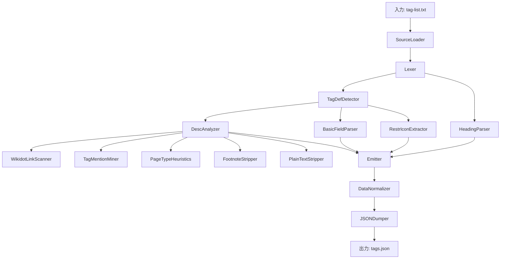

# SCP財団タグリスト解析システム実装計画

## 1. プロジェクト概要

SCP財団日本語Wikiのタグリストを解析し、タグの詳細情報（タグ名、スラッグ、英語名、説明文、カテゴリ階層、制限情報、メタ情報）を構造化されたJSONファイルとして出力するシステムを開発します。既存の`parse_jp_tags_enhanced.py`は参考にしつつも、要件定義書と「全方位解析メモ」に沿って、クラスベースの新しいシステムを構築します。

## 2. システムアーキテクチャ



## 3. データモデル（Pydantic）

```python
from pydantic import BaseModel, Field
from typing import List, Optional, NamedTuple

class Restriction(NamedTuple):
    icon: str
    meaning: str

class RelatedPage(BaseModel):
    slug: str
    display_name: Optional[str] = None

class RelatedTag(BaseModel):
    slug: str
    relation_type: str

class SourceLocation(BaseModel):
    file: str
    line: int

class Meta(BaseModel):
    related_pages: List[RelatedPage] = Field(default_factory=list)
    related_tags: List[RelatedTag] = Field(default_factory=list)
    target_page_types: List[str] = Field(default_factory=list)
    footnotes: List[str] = Field(default_factory=list)
    other_notes: List[str] = Field(default_factory=list)

class Tag(BaseModel):
    slug: str
    name_jp: str
    name_en: Optional[str] = None
    description_raw: str
    description_plain: str
    category_path: List[str]
    restrictions: List[Restriction] = Field(default_factory=list)
    meta: Meta = Field(default_factory=Meta)
    source_location: SourceLocation
```

## 4. 主要コンポーネントの詳細設計

### 4.1 SourceLoader

**目的**: Wikidotソースファイルの読み込みと`[[include]]`ディレクティブの展開

**設計**:
- クラスベースの実装
- 循環参照検出のためのDFSアルゴリズム
- ファイルパス解決のためのユーティリティ関数

```python
class SourceLoader:
    """
    Wikidotソースファイルを読み込み、includeディレクティブを展開するクラス
    """
    
    def __init__(self, base_dir: str):
        """
        Args:
            base_dir: ファイルパスの基準ディレクトリ
        """
        self.base_dir = base_dir
        self.visited = set()  # 既に処理したファイル
        self.visiting = set()  # 処理中のファイル（循環検知用）
        
    def __call__(self, entry_file: str) -> str:
        """
        エントリーファイルを読み込み、includeを展開して完全なソースを返す
        
        Args:
            entry_file: 読み込むファイルのパス
            
        Returns:
            展開されたソーステキスト
        """
        return self._process_file(entry_file)
```

### 4.2 Lexer

**目的**: 展開されたソーステキストを行単位でトークン化

```python
class Lexer:
    """
    ソーステキストを行単位でトークン化するクラス
    """
    
    def __init__(self, source: str):
        """
        Args:
            source: 解析するソーステキスト
        """
        self.lines = source.splitlines()
        self.current_line = 0
        self.total_lines = len(self.lines)
    
    def __call__(self) -> list:
        """
        ソーステキストをトークン化
        
        Returns:
            トークンのリスト
        """
        tokens = []
        
        while self.current_line < self.total_lines:
            token = self._next_token()
            if token:
                tokens.append(token)
        
        return tokens
```

### 4.3 HeadingParser

**目的**: 見出しトークンからカテゴリ階層を構築

```python
class HeadingParser:
    """
    見出しトークンからカテゴリ階層を構築するクラス
    """
    
    def __init__(self):
        """
        初期化
        """
        self.current_path = []  # カテゴリパスのスタック
    
    def __call__(self, token: dict) -> list:
        """
        トークンを処理し、現在のカテゴリパスを返す
        
        Args:
            token: 処理するトークン
            
        Returns:
            現在のカテゴリパス
        """
        if token["type"] != "heading":
            return self.current_path.copy()
        
        level = token["level"]
        title = token["title"]
        
        # レベルに応じてパスを更新
        if level == 1:
            self.current_path = [title]
        elif level == 2:
            if len(self.current_path) > 0:
                self.current_path = [self.current_path[0], title]
            else:
                self.current_path = [title]
        
        return self.current_path.copy()
```

### 4.4 TagDefDetector と関連コンポーネント

```python
class RestrIconExtractor:
    """
    制限アイコンとその意味を抽出するクラス
    """
    
    def __init__(self):
        """
        初期化
        """
        # アイコンと意味のマッピング
        self.icon_meanings = {
            "︁": "使用禁止",
            "": "編集禁止",
            "": "制限緩和/翻訳",
        }
    
    def __call__(self, icons_str: str) -> list:
        """
        アイコン文字列から制限情報のリストを抽出
        
        Args:
            icons_str: アイコンを含む文字列
            
        Returns:
            制限情報のリスト
        """
        if not icons_str:
            return []
        
        restrictions = []
        
        # カンマで区切られたアイコンを抽出
        icon_pattern = r',,[^,]+,,'
        for match in re.finditer(icon_pattern, icons_str):
            icon_with_commas = match.group(0)
            icon = icon_with_commas.strip(',')
            
            if icon in self.icon_meanings:
                meaning = self.icon_meanings[icon]
                restrictions.append(Restriction(icon=icon, meaning=meaning))
            else:
                print(f"Warning: Unknown restriction icon: {icon}")
                restrictions.append(Restriction(icon=icon, meaning="不明なアイコン"))
        
        return restrictions
```

### 4.5 DescAnalyzer

```python
class DescAnalyzer:
    """
    説明文を解析してメタ情報を抽出するクラス
    """
    
    def __init__(self):
        """
        初期化
        """
        self.link_scanner = WikidotLinkScanner()
        self.tag_mention_miner = TagMentionMiner()
        self.page_type_heuristics = PageTypeHeuristics()
        self.footnote_stripper = FootnoteStripper()
        self.plain_text_stripper = PlainTextStripper()
    
    def __call__(self, description_raw: str) -> dict:
        """
        説明文を解析してメタ情報を抽出
        
        Args:
            description_raw: 生の説明文
            
        Returns:
            メタ情報と平文説明文
        """
        # 各サブコンポーネントを順に適用
        links = self.link_scanner(description_raw)
        related_tags = self.tag_mention_miner(description_raw, links)
        page_types = self.page_type_heuristics(description_raw)
        footnotes, desc_without_footnotes = self.footnote_stripper(description_raw)
        other_notes = self._extract_other_notes(description_raw)
        plain_text = self.plain_text_stripper(desc_without_footnotes)
        
        return {
            "meta": {
                "related_pages": links,
                "related_tags": related_tags,
                "target_page_types": page_types,
                "footnotes": footnotes,
                "other_notes": other_notes
            },
            "description_plain": plain_text
        }
```

### 4.6 Emitter, DataNormalizer, JSONDumper

```python
class Emitter:
    """
    トークンからタグデータ構造を生成するクラス
    """
    
    def __init__(self):
        """
        初期化
        """
        self.heading_parser = HeadingParser()
        self.restr_icon_extractor = RestrIconExtractor()
        self.basic_field_parser = BasicFieldParser()
        self.desc_analyzer = DescAnalyzer()
    
    def __call__(self, tokens: list, source_file: str) -> list:
        """
        トークンリストからタグデータ構造を生成
        
        Args:
            tokens: トークンのリスト
            source_file: ソースファイル名
            
        Returns:
            タグデータのリスト
        """
        tags = []
        current_category_path = []
        
        for token in tokens:
            if token["type"] == "heading":
                current_category_path = self.heading_parser(token)
            
            elif token["type"] == "tag_definition":
                # 基本フィールドの解析
                tag_data = self.basic_field_parser(token)
                
                # 制限アイコンの解析
                restrictions = self.restr_icon_extractor(token.get("icons", ""))
                
                # 説明文の詳細解析
                desc_analysis = self.desc_analyzer(tag_data["description_raw"])
                
                # タグデータの構築
                tag = Tag(
                    slug=tag_data["slug"],
                    name_jp=tag_data["name_jp"],
                    name_en=tag_data["name_en"],
                    description_raw=tag_data["description_raw"],
                    description_plain=desc_analysis["description_plain"],
                    category_path=current_category_path.copy(),
                    restrictions=restrictions,
                    meta=Meta(
                        related_pages=desc_analysis["meta"]["related_pages"],
                        related_tags=desc_analysis["meta"]["related_tags"],
                        target_page_types=desc_analysis["meta"]["target_page_types"],
                        footnotes=desc_analysis["meta"]["footnotes"],
                        other_notes=desc_analysis["meta"]["other_notes"]
                    ),
                    source_location=SourceLocation(
                        file=source_file,
                        line=token["line_number"]
                    )
                )
                
                tags.append(tag)
        
        return tags
```

## 5. テスト戦略

### 5.1 ユニットテスト

各コンポーネントの機能を個別にテストします。

```python
def test_source_loader():
    """SourceLoaderのテスト"""
    # テスト用の一時ファイルを作成
    with tempfile.TemporaryDirectory() as tmpdir:
        # メインファイル
        main_file = os.path.join(tmpdir, "tag-list.txt")
        with open(main_file, 'w', encoding='utf-8') as f:
            f.write("[[include :scp-jp:fragment:test]]\n")
        
        # フラグメントファイル
        fragment_file = os.path.join(tmpdir, "fragment_test.txt")
        with open(fragment_file, 'w', encoding='utf-8') as f:
            f.write("This is a test fragment.\n")
        
        # 循環参照用ファイル
        circular_file = os.path.join(tmpdir, "fragment_circular.txt")
        with open(circular_file, 'w', encoding='utf-8') as f:
            f.write("[[include :scp-jp:fragment:circular]]\n")
        
        # テスト実行
        loader = SourceLoader(tmpdir)
        result = loader(main_file)
        
        assert "This is a test fragment" in result
```

### 5.2 結合テスト

パイプライン全体の機能をテストします。

```python
def test_full_pipeline():
    """パイプライン全体のテスト"""
    # テスト用の一時ファイルを作成
    with tempfile.TemporaryDirectory() as tmpdir:
        # テスト用のタグリストファイル
        test_file = os.path.join(tmpdir, "test-tag-list.txt")
        with open(test_file, 'w', encoding='utf-8') as f:
            f.write("+ カテゴリ1[[# cat1]]\n")
            f.write("* **[[[/system:page-tags/tag/test-tag|テストタグ]]]** //(test-tag)// - これはテスト用のタグです。\n")
        
        # パイプライン実行
        source_loader = SourceLoader(tmpdir)
        source = source_loader(test_file)
        
        lexer = Lexer(source)
        tokens = lexer()
        
        emitter = Emitter()
        tags = emitter(tokens, test_file)
        
        # 結果の検証
        assert len(tags) == 1
        assert tags[0].slug == "test-tag"
        assert tags[0].name_jp == "テストタグ"
        assert tags[0].name_en == "test-tag"
        assert tags[0].category_path == ["カテゴリ1"]
```

### 5.3 回帰テスト

既存の出力との比較テストを行います。

```python
def test_regression():
    """回帰テスト"""
    # 既存の出力と新しい出力を比較
    existing_output_file = "data/processed/jp_tags_enhanced.json"
    new_output_file = "data/processed/jp_tags_new.json"
    
    # 新しいパイプラインで出力を生成
    parse_jp_tags_new("tag-list.txt", new_output_file)
    
    # 既存の出力と比較
    with open(existing_output_file, 'r', encoding='utf-8') as f1, \
         open(new_output_file, 'r', encoding='utf-8') as f2:
        existing_data = json.load(f1)
        new_data = json.load(f2)
        
        # タグ数の比較
        assert len(existing_data) == len(new_data)
        
        # 各タグの基本情報の比較
        for i, (existing_tag, new_tag) in enumerate(zip(existing_data, new_data)):
            assert existing_tag["slug"] == new_tag["slug"]
            assert existing_tag["name_jp"] == new_tag["name_jp"]
            assert existing_tag["name_en"] == new_tag["name_en"]
```

## 6. 実装ロードマップ

1. **Day-1**: SourceLoader, Lexer, HeadingParser の実装
2. **Day-2**: TagDefDetector + RestrIconExtractor + BasicFieldParser の実装
3. **Day-3**: DescAnalyzer MVP (WikidotLinkScanner, FootnoteStripper, PlainTextStripper) の実装
4. **Day-4**: TagMentionMiner, PageTypeHeuristics の実装
5. **Day-5**: Emitter, DataNormalizer, JSONDumper の実装
6. **Day-6**: ユニットテスト + 結合テスト + 回帰テスト の実装
7. **Day-7**: ドキュメント + README + サンプル JSON の作成

## 7. 結論

この実装計画に従って開発を進めることで、要件定義書で求められている「タグシステム全貌を外部ツール無しで機械可読化」という目的を達成できます。クラスベースの設計により、拡張性と保守性を確保し、将来的な機能追加や修正にも対応しやすい構造となっています。

また、Pydantic を使用したデータモデルにより、型安全性と JSON シリアライズの標準化を実現し、後続の翻訳補助ツール・UI・可視化ダッシュボードなどの開発を容易にします。
